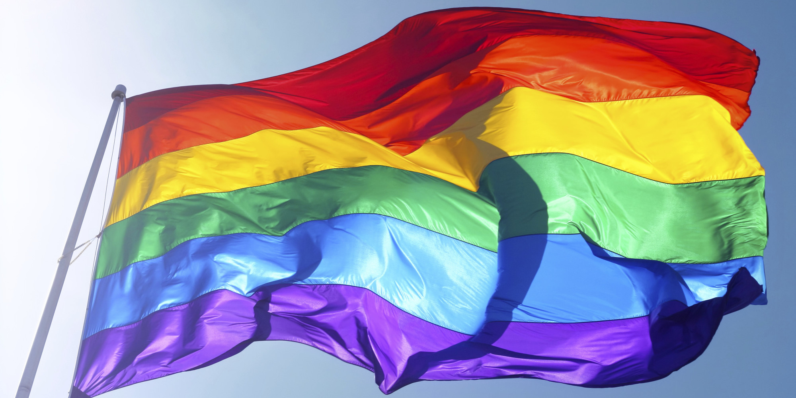

# LGBTQ
 

# About The Project

Project นี้เป็นส่วนหนึ่งในการช่วยส่งเสริมองค์กรและเครือข่ายต่อความหลากหลายทางเพศทั้งในและต่างประเทศ (ข้ามชาติ) เพื่อให้ทุกคนมีโอกาสและสิทธิเท่าเทียมกันในทุกๆ เรื่อง ไม่ว่าจะเป็นเรื่องของสุขภาพ หน้าที่การงาน สังคม รวมไปถึงทาง เศรษฐกิจอีกด้วย

# Team LGBTQ
<h2>Design</h2>
<ul>
    <li>61070092 | นาย ธีรวัฒน์ ดอนเส</li>
    <li>61070139 | นาย พันธกานต์ แก้วสังหาร</li>
    <li>61070220 | นาย ศิรวิทย์ โบศรี</li>
    <li>61070260 | นาย อมฤต นันทภักดิ์</li>
</ul>

# References
<ul>
    <li><a href="http://www.thairsc.com/">ThaiRSC</a> : ศูนย์ข้อมูลอุบัติเหตุ</li>
    <li><a href="https://data.go.th/DatasetDetail.aspx?id=71aa612f-adaf-4b0d-b81b-ccdfd97efeef">Accident Data</a> : ข้อมูลการเกิดอุบัติเหตุทางถนนโดยแยกตามรายเดือน ตั้งแต่ปี 2005 - ปัจจุบัน</li>
    <li><a href="https://www.frank.co.th/ประกันภัยรถยนต์/เคล็ดลับ/อุบัติเหตุรถยนต์">Information about road accidents</a> : รวมวิธีขับรถปลอดภัยจากอุบัติเหตุรถยนต์</li>
</ul>
