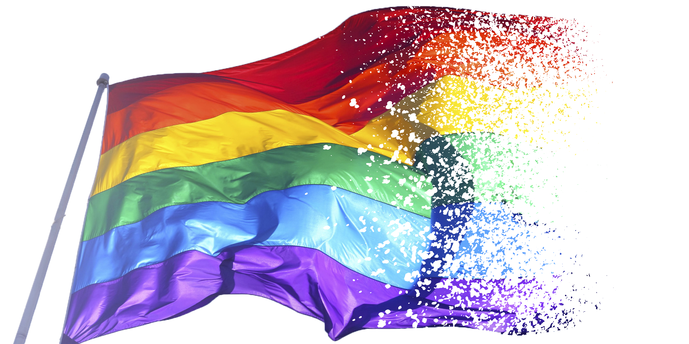

# LGBTQ
 

# About The Project

Project นี้เป็นส่วนหนึ่งในการช่วยส่งเสริมองค์กรและเครือข่ายต่อความหลากหลายทางเพศทั้งในและต่างประเทศ (ข้ามชาติ) เพื่อให้ทุกคนมีโอกาสและสิทธิเท่าเทียมกันในทุกๆเรื่อง ไม่ว่าจะเป็นเรื่องของสุขภาพ หน้าที่การงาน สังคม รวมไปถึงทาง เศรษฐกิจอีกด้วย

# Team LGBTQ
<h3>Design</h3>
<ul>
    <li>61070122 | นาย ปุญญพัฒน์ แปลงพระเนตร</li>
</ul>
<h3>Content</h3>
<ul>
    <li>61070220 | นาย ศิรวิทย์ โบศรี</li>
</ul>
<h3>WordPress Developer</h3>
<ul>
    <li>61070340 | นาย คณิติน ผลงาม</li>
    <li>61070139 | นาย พันธกานต์ แก้วสังหาร</li>
</ul>
<h3>Web Developer</h3>
<ul>
    <li>...</li>
    <li>...</li>
</ul>

# References
<ul>
    <li><a href="http://www.thairsc.com/">...</a>...</li>
    <li><a href="https://data.go.th/DatasetDetail.aspx?id=71aa612f-adaf-4b0d-b81b-ccdfd97efeef">...</a>...</li>
    <li><a href="https://www.frank.co.th/ประกันภัยรถยนต์/เคล็ดลับ/อุบัติเหตุรถยนต์">...</a>...</li>
</ul>
